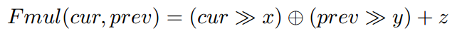

- [Interesting Fuzzing](#interesting-fuzzing)
    - [Coverage-based Greybox Fuzzing as Markov Chain(CCS 16)](#coverage-based-greybox-fuzzing-as-markov-chainccs-16)
    - [T-Fuzz: fuzzing by program transformation(S&P 18)](#t-fuzz-fuzzing-by-program-transformationsp-18)
    - [CollAFL: Path Sensitive Fuzzing(S&P 18)](#collafl-path-sensitive-fuzzingsp-18)
    - [Driller: Argumenting Fuzzing Through Selective Symbolic Execution(ndss 16)](#driller-argumenting-fuzzing-through-selective-symbolic-executionndss-16)
    - [VUzzer: Application-aware Evolutionary Fuzzing(ndss 17)](#vuzzer-application-aware-evolutionary-fuzzingndss-17)
    - [Angora: Efficient Fuzzing by Principled Search(S&P 18)](#angora-efficient-fuzzing-by-principled-searchsp-18))
    - [Designing New Operating Primitives to Improve Fuzzing Performance(CCS 17)](#designing-new-operating-primitives-to-improve-fuzzing-performanceccs-17)
    - [QSYM: A Practical Concolic Execution Engine Tailored for Hybrid Fuzzing(Usenix 18)](#qsym-a-practical-concolic-execution-engine-tailored-for-hybrid-fuzzingusenix-18)
    - [FairFuzz: A Targeted Mutation Strategy for Increasing Greybox Fuzz Testing Coverage(ASE 18)](#fairfuzz-a-targeted-mutation-strategy-for-increasing-greybox-fuzz-testing-coveragease-18)
    - [Full-speed Fuzzing: Reducing Fuzzing Overhead through Coverage-guided Tracing(oakland 19)](#full-speed-fuzzing-reducing-fuzzing-overhead-through-coverage-guided-tracingoakland-19)
    - [ProFuzzer: On-the-fly Input Type Probing for Better Zero-day Vulnerability Discovery(oakland 19)](#profuzzer-on-the-fly-input-type-probing-for-better-zero-day-vulnerability-discoveryoakland-19)
    - [NEUZZ: Efficient Fuzzing with Neural Program Smoothing(oakland 19)](#neuzz-efficient-fuzzing-with-neural-program-smoothingoakland-19 )

- [Directed Fuzzing](#directed-fuzzing)
    - [Directed Greybox Fuzzing(CCS 17)](#directed-greybox-fuzzingccs-17)
    - [Hawkeye: Towards a Desired Directed Grey-box Fuzzer(CCS 18)](#hawkeye-towards-a-desired-directed-grey-box-fuzzerccs-18)

- [Fuzzing Machine Learning Model](#fuzzing-machine-learning-model)
    - [TensorFuzz: Debugging Neural Networks with Coverage-Guided Fuzzing(18)](#tensorfuzz-debugging-neural-networks-with-coverage-guided-fuzzing18)
    - [Coverage-Guided Fuzzing for Deep Neural Networks](#coverage-guided-fuzzing-for-deep-neural-networks18)

- [Kernel Fuzzing](#kernel-fuzzing)
    - [RAZZER: Finding Kernel Race Bugs through Fuzzing(oakland 19)](#razzer-finding-kernel-race-bugs-through-fuzzingoakland-19)
    - [kAFL: Hardware-Assisted Feedback Fuzzing for OS Kernels(Usenix Security 17)](#kafl-hardware-assisted-feedback-fuzzing-for-os-kernelsusenix-security-17)
    - [Fuzzing File Systems via Two-Dimensional Input Space Exploration(oakland 19)](#fuzzing-file-systems-via-two-dimensional-input-space-explorationoakland-19)
    - [PeriScope: An Effective Probing and Fuzzing Framework for the Hardware-OS Boundary(NDSS 19)](#periscope-an-effective-probing-and-fuzzing-framework-for-the-hardware-os-boundaryndss-19)

- [Evaluate Fuzzing](#evaluate-fuzzing)
    - [Evaluating Fuzz Testing(CCS 18)](#evaluating-fuzz-testingccs-18)


# Interesting Fuzzing

## Coverage-based Greybox Fuzzing as Markov Chain(CCS 16)

* [paper](https://github.com/bin2415/fuzzing_paper/tree/master/paper/CCS16_aflfast.pdf)
* [source code](https://github.com/mboehme/aflfast)

- Search Strategy
- Power Schedule
- 通过改变前面两个方法来使程序更大概率地走到low-density region.

## T-Fuzz: fuzzing by program transformation(S&P 18)

* [paper](https://github.com/bin2415/fuzzing_paper/tree/master/paper/oakland18_T-Fuzz.pdf)
* [source code](https://github.com/HexHive/T-Fuzz)

- Fuzzer: T-Fuzz uses an existing coverage guided fuzzer to generate inputs. T-Fuzz depends on the fuzzer to keep track of the paths taken by all the generated inputs and realtime status infomation regarding whether it is "stuck". As output, the fuzzer produces all the generated inputs. Any identified crashing inputs are recorded for further anlysis.
- Program Transformer: When the fuzzer gets "stuck", T-Fuzz invokes its Program Transformer to generate tranformed programs. Using the inputs generated by the fuzzer, the Program Transformer first traces the program under test to detect the NCC candidates and then transforms copies of the program by removing certain detected NCC candidates.
- Crash Analyzer: For crashing inputs found against the transformed programs, the Crash Analyser filters false positives using a symbolic-execution based analysis technique.

### T-Fuzz Design

- Detecting NCCs: NCCs are those sanity checks which are present in the program logic to filter some orthogonal data, e.g., the check for a magic value in the decompressor example above. NCCs can be removed without triggering spurious bugs as they are not intended to prevent bugs. This paper uses a lightweight method to find the NCCs. Firstly, they define the concept of boundary edges: the edges connecting the nodes that were covered by the fuzzer-generated inputs and those that were not. The method that find the NCCs in this paper is over-approximation, so they find two ways to prune undesired NCC condidates.
- Program Transformation: After finding NCCs, T-Fuzz should "remove" the NCCs conditions to guide the execution to the another branch. T-Fuzz transforms programs by replacing the detected NCC candidates with negated conditional jump.
- Filtering out False Positives and Reproducing Bugs: As the removed NCC candidates might be meaningful guards in the original program(as opposed to, e.g., magic number checks), removing detected NCC edges might introduce new bugs in the transformed program. Consequently, T-Fuzz's Crash Analyzer verifies that each bug in the transformaed program is also present in the original proram, thus filtering out false positives. The Crash Analyser uses a transformation-aware combination of the preconstrained tracing technique leveraged by Driller and the Path Kneading techniques proposed by ShellSwap to collect path constraints of the original program by tracing the program path leading to a crash in the transformed program.

## CollAFL: Path Sensitive Fuzzing(S&P 18)

* [paper](https://github.com/bin2415/fuzzing_paper/tree/master/paper/oakland18_collafl.pdf)
* source code has not been found.

该paper主要对AFL有两个改进:

- AFL是coverage-based greybox fuzzing，它通过对源程序进行轻量级的插桩，来跟踪每次fuzzing的input覆盖哪些路径，然后将路径hash，从而判断每个input是否到达了一个新的路径，如果到达新的路径，则说明该input较好，将该input作为seed。但由于hash可能会发生collision，可能会导致某些input到达新的路径，却没有将该input作为seed。该paper主要针对这一点，采用了一个新的算法，解决了路径hash collision问题，产生的效果也是比较显著的。
- 提供了一些策略来将seed进行排序，促使fuzzer去探索没有到达的路径。具体做法就是如果某条路径有很多没有探索到的邻居分支，则对该input进行更多的变异；如果某条路径有很多没有探索到的邻居后代，则对该input产生更多的变异。还有一个策略来帮助发现更多的漏洞：如果某条路径进行更多的内存访问，则对该input产生更多的变异。

我个人认为，该论文的主要贡献是提供了一个机制来解决路径的hash collision问题，使得coverage判断更加准确。

### AFL Coverage Measurements

AFL使用bitmap(默认64KB)来跟踪edge coverage。没一个字节都对应特定edge的hit count。AFL通过对每个basic block进行插桩，为每个basic block都随机分配一个id，当执行每条路径时，对该路径上的每个basic block都进行如下操作:

```c
cur_location= <COMPILE_TIME_RANDOM>;
shared_mem[cur_location ^ prev_location]++;
prev_location = cur_location >> 1;
```
其中上面的prev_location右移一位主要是为了区分路径A->B和B->A。由于每个basic block的id是随机分配的，所以这种hash方法很容易产生collision，特别当程序比较大的时候，collision rate也越大。

### CollAFL's Solution to Hash Collision

CollAFL通过三种方式来解决hash collision:

1.  
    通过贪心算法，为每个basic block分配x和y的值，保证每条edge计算的hash值都是不同的。
2. 如果每个basic block只有一个前继basic block，即只有一条边到达该basic block，所以只需要将该basic block的id来表示该edge即可。
3. 如果前面两种方法无法解决，则动态的时候为每条边分配不同的id。


## Driller: Argumenting Fuzzing Through Selective Symbolic Execution(ndss 16)

* [paper](https://github.com/bin2415/fuzzing_paper/tree/master/paper/NDSS16_driller.pdf)
* [source code](https://github.com/shellphish/driller)

我们都知道，fuzzing对于一些比较宽松的限制(比如x>0)能够很容易的通过变异产生一些输入达到该条件；而symbolic execution非常擅长求解一下magic value(比如x == deadleaf)。这是一篇比较经典的将concolic execution和fuzzing结合在一起的文章，该文章的主要思想就是先用AFL等Fuzzer根据seed进行变异，来测试程序。当产生的输入一直走某些路径，并没有探测到新的路径时，此时就"stuck"了。这时，就是用concolic execution来产生输入，保证该输入能走到一些新的分支。从而利用concolic execution来辅助fuzz。

## VUzzer: Application-aware Evolutionary Fuzzing(ndss 17)

* [paper](https://github.com/bin2415/fuzzing_paper/tree/master/paper/ndss17_vuzzer.pdf)
* [source code](https://github.com/vusec/vuzzer)

Vuzzer是公认的比较好的类AFL fuzzer。它主要利用Data-flow features和Control-flow features来辅助fuzzer变异和进行seed的选择。

### Data-flow features

利用dynamic taint analysis 来推断input的结构和类型，以及某段数据在input的偏移。比如，它通过对每个cmp指令进行插桩来判断input的哪些字节与输入有关，并且知道与它比较的另外一个值。同时，Vuzzer也可以对lea指令进行插桩，从而检测*index*操作是不是与input某些bytes有关。

### Control-flow features

Control-flow features可以让Vuzzer推断出执行路径的重要性。比如，某些执行路径最后到达了*error-hanling blocks*。Vuzzer就通过静态的方法识别出了一下*error-handling code*。同时，Vuzzer通过对每个basic block赋予特定的权重，来促使fuzzer走到更深的路径中去。

## Angora: Efficient Fuzzing by Principled Search(S&P 18)

* [paper](https://github.com/bin2415/fuzzing_paper/blob/master/paper/oakland18_Angora.pdf)
* [source code](https://github.com/AngoraFuzzer/Angora)

This paper's contributations:

- *Context-sensitive branch coverage.* AFL uses context-insensitive branch coverage to approximate program states. This paper adding context information to branch.
- *Scalable byte-level taint tracking.* Most path constraints depend on only a few bytes in the input. By tracking which input bytes flow into each path constraint, Angora mutates only these bytes instead of the entire input, therefore reducing the space of exploration substantially.
- *Search based on gradient descent.* When mutating the input to satisfy a path constraint. Angora avoids symbolic execution, which is expensive and cannot solve many types of constraints. Instead, Angora uses the gradient descent algorithm popular in machine learning to solve path constraints.
- *Type and shape inference.* Many bytes in the input are used collectively as a single value in the program, e.g., a group of four bytes in the input used as a 32-bit signed integer in the program. To allow gradient descent to search efficiently, Angora locates the above group and infers its type.

## Designing New Operating Primitives to Improve Fuzzing Performance(CCS 17)

* [paper](https://github.com/bin2415/fuzzing_paper/blob/master/paper/ccs17_prefFuzz.pdf)
* [source code](https://github.com/sslab-gatech/perf-fuzz)

### AFL Overview


- Mutating inputs(1). AFL uses an evolutionary coverage-based mutation technique to generate test cases for discovering new execution paths of the target application. In AFL, an execution path is represented as a sequence of taken branches(i.e., a coverage bitmap) in the target instance for a given input. To track whether a branch is taken, AFL instruments every conditional branch and function entry of the target application at the time of compilation.
- Launching the target application(2). Traditional fuzzers call *fork()* followed by *execve()* to launch an instance of the target application. This process occurs in every fuzzing loop to deliver a new input to the target application. It is not only time consuming, but also a non-scalable operation. Previous research shows that the majority of fuzzing execution explores only the shallow part of the code and terminates quickly(e.g., because of invalid input format), which results in frequent executions for the input cases. Thus, the cost of fork() and execve() dominates the cost of fuzzing. To mitigate this cost, AFL introduced a fork server, which is similar to a Zygote process in Android that eliminates the heavyweight execve() system call. After instantiating a target application, the fork server waits for a starting signal sent over the pip from the AFL instance. Upon receiving the request, it first clones the already-loaded program using fork() and the child process continues the execution of the original target code immediately from the entry point(i.e., main) with a given input generated for the current fuzzing loop. The parent process waits for the termination of its child, and then informs the AFL process. The AFL process collects the branch coverage of the past execution, and maintains the test input if it is interesting.
- Bookkeeping results(3, 4). The fork server also initializes a shared memory(also known as tracing bitmap) between the AFL instance and the target application. The instance records all the coverage information during the execution and writes it to the shared tracing bitmap, which summarizes the branch coverage of the past execution.
- Fuzzing in parallel(6). AFL also supports parallel fuzzing to completely utilize resources available on a multi-core machine and expedite the fuzzing process. In this case, each AFL instance independently executes without explicit contention among themselves(i.e., embarrassingly parallel). From the perspective of the design of AFL, the fuzzing operation should linearly scale with increasing core count. Moreover, to avoid apparent contention on file system accesses, each AFL instance works in its private working directory for test cases. At the end of a fuzzing loop, the AFL instance scans the output directories of other instances to learn their test cases, called the *syncing phase*. For each collaborating neighbor, it keeps a test case identifier, which indicates the last test case it has checked. It figures out all the test cases that have an identifier larger than the reserved one, and re-executes them one by one. If a test case covers a new path that has not been discovered by the instance itself, the test case is copied to its oen directory for further mutation.

## QSYM: A Practical Concolic Execution Engine Tailored for Hybrid Fuzzing(Usenix 18)

* [paper](https://github.com/bin2415/fuzzing_paper/blob/master/paper/usenix18_qsym.pdf)
* [source code](https://github.com/sslab-gatech/qsym)

该paper是Usenix 18的Distinguished Paper，其主要针对了当前的concolic execution的三个方面进行了优化: Slow Symbolic Emulation, Ineffective Snapshot and Slow and Inflexible Sound Analysis. 从而使得concolic execution更好的适应fuzzing场景。

### Motivation: Performance Bottlenecks

#### Slow Symbolic Emulation

现在主流的conclic executors做符号执行的时候是针对IR中间语言做的(比如KLEE的LLVM IR和angr的VEX IR)，对中间语言模拟执行。其*采用IR的原因是实现起来比较简单*。由于Intel 64位指令集包含1795条指令，所以针对每条指令总结出来符号的语义对于人工来说是一个非常大的工作量，而IR的指令较少(LLVM IR有62条指令)，符号化这些指令相对比较简单。

然而使用IR则引发了额外的overhead。首先，从机器指令到IR的转换本身就有overhead。由于amd64是CISC(complex instruction set computer)，而IR是RISC(reduced instruction set computer)，一般一条amd64的指令需要转换成多条IR指令，拿angr为例，如果将amd64指令转为VEX IR，则平均增加的指令数是4.69倍。其次，采用IR导致basic block level taint。因为由于效率的原因，从native instructions到IR的转换一般是以basic block为单位的，这样就导致无法将单个的native instruction转换成IR，所以也就只能做到哪些basic block需要符号化，而不是具体的某条指令需要符号化。这样做导致的后果就是如果某个basic block中只有一条指令和输入有关需要符号化，则整个basic block都需要符号模拟，这样就会造成很高的overhead。如果没有IR的话就可以做到指令级别的taint，就能够清楚的判断哪些指令需要符号模拟，哪些指令只需native execution，减少了不必要的符号模拟。实验表明，在一个basic block中，只有30%的指令需要符号模拟。

#### Ineffective Snapshot

snapshot是conclic execution常用的一个技术，它能够保存某条分支前的状态S，当该分支执行完或者"stuck"时，可以从该状态S直接执行另外一个分支，避免了重新执行的overhead。然而snapshot本身就有一些缺点：snapshot需要保存一些外部的状态(文件系统，内存管理系统)，则此时需要对影响外部状态的系统调用进行处理，一般有两个方法: full system concolic execution and External environment modeling。这两个方法都有一些缺陷：第一个方法是由于外部环境比较复杂，实现起来比较难，overhead较高；第二个则是model的system call较少，并且有些system call建模的不够完全。另外由于fuzzing的输入一般不会共享同一个分支，所以snapshot可能对于fuzzing这个场景也不是很好，所以该paper就没有采用snapshot的机制，对于每个输入都会重新执行，对于系统调用，则具体执行。

#### Slow and Inflexible Sound Analysis

现在的concolic execution是将某条路径上的所有contraints都满足，从而求解出具体的input。然而复杂的contraints可能会导致输入求解不出。所以该paper的一个解决方法就是只求解出部分contraints。

## FAIRFUZZ: A Targeted Mutation Strategy for Increasing Greybox Fuzz Testing Coverage(ASE 18)

* [paper](https://github.com/bin2415/fuzzing_paper/blob/master/paper/ase18-fairfuzz.pdf)
* [source code](https://github.com/carolemieux/afl-rb)

FairFuzz focus on branch coverage, it works in two main steps.

First, it identifies the program branches that are rarely hit by previously-generated inputs.  It call such branches rare branches. These rare branches guard under-explored functionalities of the program. By generating more random inputs hitting these rare branches, FairFuzz greatly increases the coverage of the parts of the code guarded by them.

Second, FairFuzz uses a novel lightweight mutation technique to increase the probability of hitting these rare branches. The mutation stategy is based on the observation that certain parts of an input already hitting a rare branch are crucial to satify the conditions necessary to hit that branch. Therefore, to generate more inputs hitting the rare branch via mutation, the parts of the input that are crucial for hitting the branch should not be mutated.

## Full-speed Fuzzing: Reducing Fuzzing Overhead through Coverage-guided Tracing(oakland 19)

* [paper](https://arxiv.org/pdf/1812.11875.pdf)
* [source code](https://github.com/FoRTE-Research/UnTracer-AFL)

## ProFuzzer: On-the-fly Input Type Probing for Better Zero-day Vulnerability Discovery(oakland 19)

* [paper](https://www.computer.org/csdl/proceedings/sp/2019/6660/00/666000a883.pdf)

## NEUZZ: Efficient Fuzzing with Neural Program Smoothing(oakland 19)

* [paper](https://www.computer.org/csdl/proceedings/sp/2019/6660/00/666000a901.pdf)
* [code](https://github.com/Dongdongshe/neuzz)

# Directed Fuzzing

## Directed Greybox Fuzzing(CCS 17)

* [paper](https://github.com/bin2415/fuzzing_paper/tree/master/paper/CCS17_aflgo.pdf)
* [source code](https://github.com/aflgo/aflgo)

```c
Input: Seed Input S

repeat
    s = CHOOSENEXT(S)
    p = ASSIGNENERGY(s)    //This paper focus
    for i from 1 to p do
        s' = MUTATE_INPUT(s)
        if t' crashes then
            add s' to Sx
        else if ISINTERESTING(s') then
            add s' to S
        end if
    end for
until timeout reached or abort-signal

Output: Crashing Inputs Sx
```

类AFL的fuzzing一般步骤如上所示，该paper主要关注于ASSIGNENERGY(s)这一操作，他们通过对不同的seed s赋予不同的energy，即如果一个seed s'产生的trace距离目标基本块targetB较近，则其energy(p)就较大，基于种子s'进行的变异操作就会变多。所以该paper主要有两个contributation: 设计一套算法计算seed s'产生的trace与targetB的距离；通过模拟退火算法来为每个seed s分配energy。

## Hawkeye: Towards a Desired Directed Grey-box Fuzzer(CCS 18)

* [paper](https://github.com/bin2415/fuzzing_paper/tree/master/paper/ccs18_hawkeye.pdf)
* source code has not been found.

### Desired Properties of Directed Fuzzing

- P1. The DGF should define a **robust** distance-based mechanism that can guide the directed fuzzing by avoiding the bias to some traces and considering all traces to the targets.
- P2. The DGF should strike a balance between overheads and utilities in static analysis.
- P3. The DGF should select and schedule the seeds to rapidly reach target sites. AFL determines how many new inputs(i.e., "energy") should be generated from a seed input to improve the fuzzing effectiveness(i.e., increase the coverage); this is termed "power scheduling".
- P4. The DGF should adopt an adaptive mutation strategy when the seeds cover the different program states. The desired design is that when a seed has already reached the target sites(including target lines, basic blocks or functions), it should be given less chances for coarse-grained mutations(e.g., chunk replacement).

### AFLGo's Solution

- 针对P1，AFLGo只是选择路径最短的那条，然而路径最短的那条可能无法触发某个漏洞。
- For P2. AFLGo only considers the explicit call graph information. As a result, function pointers are treated as the external nodes which are ignored during distance calculation. Besides, AFLGo counts the same callee in tis callers only once, and it does not differentiate multiple call patterns between the caller and callee.
- For P3. AFLGo applies a simulated annealing based power scheduler: it favors those seeds closer to the targets by assigning more energy to them to be mutated; the applied cooling sechedule initially assigns smaller weight on the effecte of "distance guidance", until it reaches the "exploitation" phrase. The issue is that there is no prioritization procedure so the newly generated seeds with smaller distance may wait for a long to be mutated.
- For P4. The mutation operators of AFLGo come from AFL's two non-deterministic strategies: 1) havoc, which does purely randomly mutations such as bit flips, bytewise replace, etc; 2) splice, which generates seeds from some random byte parts of two existing seeds. Notably, during runtime AFLGo excludes all the deterministic mutation procedures and relies purely on the power scheduling on havoc/splice strategies.

### Suggestions to improve DGFs:

- For P1, a more accurate distance definition is needed to retain trace diversity, avoiding the focus on short traces.
- For P2, both direct and indirect calls need to be analyzed; various call patterns need to be distinguished during static distance calculation.
- For P3, a moderation to the current power scheduling is required. The distance-guided seed prioritization is also needed.
- For P4, the DGF needs an adaptive mutation strategy, which optimally applies the fine-grained abd ciarse-graubed nytatuibs wgeb tge dustabce between the seed to the targets is different.

### Hawkeye's Design


During fuzzing, the fuzzer selects a seed from a priority seed queue. The fuzzer applies a power scheduling against the seed with the goal of giving those seeds that are considered to be "closer" to the target sites more mutation chances, i.e, energy. Specifically, this is achieved through a power function, which is a combination of the *covered function similarity* and the *basic block trace distance*. For each newly generated test seed during mutation, after capturing its execution trace, the fuzzer will calculate the covered function similarity and the basic block trace distance based on the utilities. For each input execution trace, its basic block trace distance is calculated as the accumulated basic block level distances divided by the total number of executed basic blocks; and its covered function similarity is calculated based on the overlapping of current executed functions and the target function trace closure, as well as the function level distance.

After the energy is determined, the fuzzer adaptively allocates mutation budgets on two different categories of mutations according to mutators' granularities on the seed(coarse-grained mutations and fine-grained mutations). Afterwards, the fuzzer evaluates the newly generated seeds to prioritize those that have more energy or that have reached the target functions.


# Fuzzing Machine Learning Model

## TensorFuzz: Debugging Neural Networks with Coverage-Guided Fuzzing(18)

* [paper](https://github.com/bin2415/fuzzing_paper/tree/master/paper/tensorfuzz.pdf)
* [source code](https://github.com/brain-research/tensorfuzz)

## Coverage-Guided Fuzzing for Deep Neural Networks(18)

* [paper](https://github.com/bin2415/fuzzing_paper/blob/master/paper/18_coverage-guided-fuzzing-for-deep-neural-networks.pdf)

# Kernel Fuzzing

## RAZZER: Finding Kernel Race Bugs through Fuzzing(oakland 19)

* [paper](https://github.com/bin2415/fuzzing_paper/blob/master/paper/oakland19_RAZZER.pdf)
* [source code](https://github.com/compsec-snu/razzer)

## kAFL: Hardware-Assisted Feedback Fuzzing for OS Kernels(Usenix Security 17)

* [paper](https://github.com/bin2415/fuzzing_paper/blob/master/paper/usenix17_kafl.pdf)
* [source code](https://github.com/RUB-SysSec/kAFL)

## Fuzzing File Systems via Two-Dimensional Input Space Exploration(oakland 19)

* [paper](https://github.com/bin2415/fuzzing_paper/blob/master/paper/oakland19_fuzzing_file_system.pdf)

## PeriScope: An Effective Probing and Fuzzing Framework for the Hardware-OS Boundary(NDSS 19)

* [paper](https://people.cs.kuleuven.be/~stijn.volckaert/papers/2019_NDSS_PeriScope.pdf)
* [source code](https://github.com/securesystemslab/periscope)

# Evaluate Fuzzing

## Evaluating Fuzz Testing(CCS 18)

* [paper](https://github.com/bin2415/fuzzing_paper/blob/master/paper/ccs18_Evaluating%20Fuzz%20Testing.pdf)

They found that:

- Most papers failed perform multiple runs, and those that did failed to account for varying performance by using a statistical test.
- Many papers measured fuzzer performance not by counting distinct bugs, but instead by counting "unique crashes" using heuristics such as
AFL's coverage measure and stack hashes.
- Many papers used short timeouts, without justification.
- Many papers did not carefully consider the impact of seed choices on algorithmic improvements.
- Papers varied widely on their choice of target programs.

